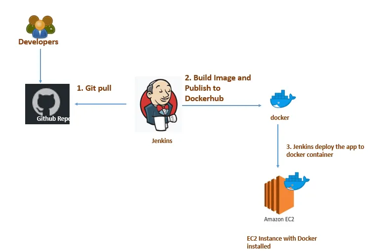
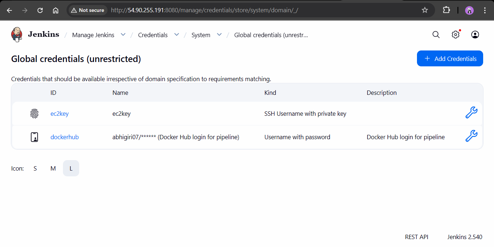
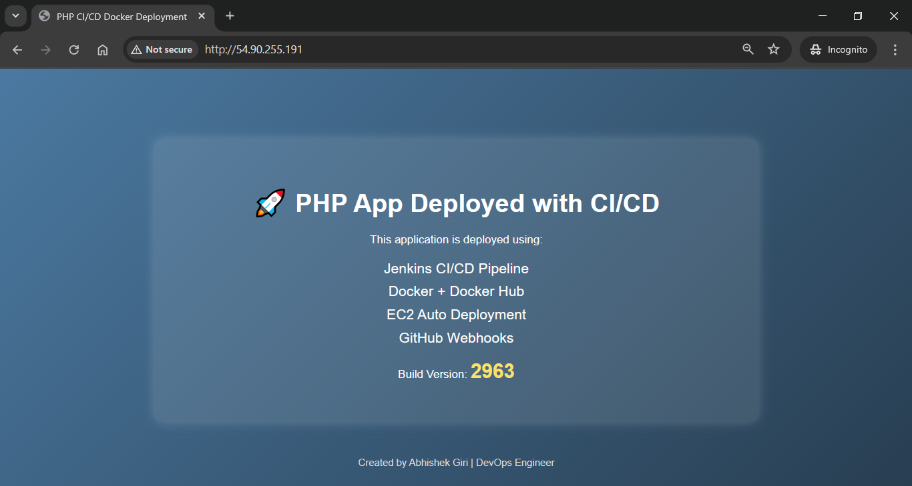

# CI/CD Pipeline for Dockerized PHP App — Jenkins + GitHub + Docker Hub

This project demonstrates a fully automated __CI/CD pipeline__ for a Docker-based application using __Jenkins, GitHub, and Docker Hub__. Whenever you push code to the GitHub repository, Jenkins automatically pulls the latest changes, builds a Docker image, pushes it to Docker Hub, and deploys the updated container on the server. This pipeline ensures fast, consistent, and reliable delivery of your application with zero manual steps. It represents a real-world DevOps workflow used in modern production environments.



### Project structure
home/ubuntu/app
├── docker-compose.yml 
└── deploy.sh 

### Prerequisites

* GitHub account + repository
* Docker Hub account
* Jenkins server (EC2/VM) with:
  * Java installed (OpenJDK 17 or later)
  * Jenkins installed and running (port 8080)

### Step 1: Server Setup

Install Docker:
```bash
sudo apt update
sudo apt install -y docker.io
sudo systemctl enable --now docker
```

Install Java & Jenkins
```bash
sudo apt install -y openjdk-17-jdk
sudo wget -O /etc/apt/keyrings/jenkins-keyring.asc \
  https://pkg.jenkins.io/debian-stable/jenkins.io-2023.key
echo "deb [signed-by=/etc/apt/keyrings/jenkins-keyring.asc]" \
  https://pkg.jenkins.io/debian-stable binary/ | sudo tee \
  /etc/apt/sources.list.d/jenkins.list > /dev/null
sudo apt update
sudo apt install jenkins

```

Give Jenkins permission to access Docker:
```bash
sudo usermod -aG docker jenkins
sudo systemctl restart docker
sudo systemctl restart jenkins
```

### Step-2: Create Files
```bash
mkdir -p /home/ubuntu/app
cd /home/ubuntu/app
```
Add:
* ```deploy.sh```
* ```docker-compose.yml```

 __```deploy.sh```__
 ```
#!/bin/bash

IMAGE="your-dockerhub-username/your-image-name:latest"
CONTAINER_NAME="phpapp"

echo "Pulling latest image..."
docker pull $IMAGE

echo "Stopping old container (if exists)..."
docker stop $CONTAINER_NAME || true
docker rm $CONTAINER_NAME || true

echo "Starting new container..."
docker run -d --name $CONTAINER_NAME -p 80:80 $IMAGE

echo "PHP App deployed successfully!"
 ```
 Make it executable:
 ```
 sudo chmod +x deploy.sh
 ```
 ---

 __```docker-compose.yml```__

 ```
 services:
  phpapp:
    image: abhigiri07/jenkinsdocker:latest
    container_name: phpapp
    restart: always
    ports:
      - "80:80"
 ```
---

Step 3: Create Jenkinsfile

```jenkins
pipeline {
    agent any

    environment {
        DOCKERHUB = "abhigiri07"      // your Docker Hub username
        IMAGE = "jenkinsdocker"        // your Docker Hub repository name
        EC2_USER = "ubuntu"           
        EC2_HOST = "52.201.238.55"     
    }

    triggers {
        githubPush()
    }

    stages {

        stage('Checkout Code') {
            steps {
                git branch: 'main', url: 'https://github.com/abhigiri07/Jenkins-Docker.git'
            }
        }

        stage('Build Docker Image') {
            steps {
                script {
                    sh "docker build -t ${DOCKERHUB}/${IMAGE}:latest ."
                }
            }
        }

        stage('Login to Docker Hub') {
            steps {
                script {
                    withCredentials([usernamePassword(credentialsId: 'dockerhub', usernameVariable: 'USER', passwordVariable: 'PASS')]) {
                        sh """
                        echo $PASS | docker login -u $USER --password-stdin
                        """
                    }
                }
            }
        }

        stage('Push Docker Image') {
            steps {
                script {
                    sh "docker push ${DOCKERHUB}/${IMAGE}:latest"
                }
            }
        }

        stage('Deploy to EC2') {
            steps {
                script {
                    withCredentials([sshUserPrivateKey(credentialsId: 'ec2key', keyFileVariable: 'SSH_KEY')]) {
                        sh """
                        ssh -o StrictHostKeyChecking=no -i ${SSH_KEY} ${EC2_USER}@${EC2_HOST} '
                            cd /home/ubuntu/app &&
                            ./deploy.sh
                        '
                        """
                    }
                }
            }
        }
    }

    post {
        success {
            echo "Deployment Successful!"
        }
        failure {
            echo "Deployment Failed — Check Console Output."
        }
    }
}

```
---
Create Dockerfile:

__```Dockerfile```__
```
FROM php:8.2-apache

# Enable Apache rewrite module
RUN a2enmod rewrite

# Copy project files
COPY . /var/www/html/

EXPOSE 80
```
---
__```index.php```__
```html

<!DOCTYPE html>
<html lang="en">
<head>
    <meta charset="UTF-8">
    <meta name="viewport" content="width=device-width, initial-scale=1.0">
    <title>PHP CI/CD Docker Deployment</title>
    <link rel="stylesheet" href="style.css">
</head>
<body>

<div class="container">
    <h1>🚀 PHP App Deployed with CI/CD</h1>
    <p>This application is deployed using:</p>

    <ul>
        <li>Jenkins CI/CD Pipeline</li>
        <li>Docker + Docker Hub</li>
        <li>EC2 Auto Deployment</li>
        <li>GitHub Webhooks</li>
    </ul>

    <p class="version">Build Version: 
        <span>
            <?php echo rand(1000, 9999); ?>
        </span>
    </p>
</div>

<footer>
    <p>Created by Abhishek Giri | DevOps Engineer</p>
</footer>

</body>
</html>
```
---
__```style.css```__
```css
body {
    margin: 0;
    padding: 0;
    font-family: Arial, Helvetica, sans-serif;
    background: linear-gradient(135deg, #4b79a1, #283e51);
    color: white;
    text-align: center;
}

.container {
    margin-top: 100px;
    background: rgba(255, 255, 255, 0.1);
    padding: 40px;
    border-radius: 12px;
    width: 60%;
    margin-left: auto;
    margin-right: auto;
    box-shadow: 0px 0px 15px rgba(255, 255, 255, 0.2);
}

h1 {
    font-size: 36px;
    margin-bottom: 20px;
}

ul {
    list-style: none;
    padding: 0;
    font-size: 20px;
}

ul li {
    margin: 10px 0;
    font-weight: 300;
}

.version span {
    font-size: 28px;
    font-weight: bold;
    color: #ffe066;
}

footer {
    margin-top: 50px;
    font-size: 14px;
    color: #ddd;
    padding-bottom: 20px;
}
```
---

### Step 3: Add GitHub webhook
In GitHub repository settings → Webhooks → Add webhook:

* Payload URL: http://<JENKINS_HOST>:8080/github-webhook/
* Content type: application/json
* Events: Just the push event 
.png)

---
### Step 4: Install Plugins in jenkins
Manage Jenkins  → Plugins:
1. Git
2. Ssh Agent
3. Pipeline
4. Github 

---

### Step 5: Jenkins: create credentials
Manage Jenkins → Credentials → System → Global credentials:

1.Docker Hub (Kind: Username with password)
* Username: ```<dockerhub-username>```
* Password: ```<dockerhub-password>```
* ID: ```dockerhub```

2. EC2 SSH Key (Kind: SSH Username with private key)
* Username: ubuntu (or ec2-user)
* Private Key: paste your private key
* ID: ec2key



---

### Step 6: Create the Jenkins pipeline job

* In Jenkins: New Item → Pipeline → give name → OK.
* In Build Triggers select GitHub hook trigger for GITScm polling.
* Pipeline Definition: point to your Jenkinsfile in SCM..
* SCM: Git
* Repository URL: ```<YOUR_JENKINSFILE_REPO_URL>```
* branch: ```Main```(Depends on your repo)

.png)
---

Now, Deploy or update code on Github to trigger webhook

.png)

---
### Output
```
http://<EC2_Public_IP>
```


---

### Screenshots
Jenkins Bulid:
.png)

Live Container and image:
.png)

---

### Conclusion
This project shows how you can automatically build and deploy your app using __Jenkins, GitHub, and Docker Hub__ without doing anything manually. Every time you update your code, the pipeline takes care of pulling the changes, creating a new Docker image, and running the latest version of your app. This makes your work faster, easier, and more organized — just like real DevOps teams do in companies.

----